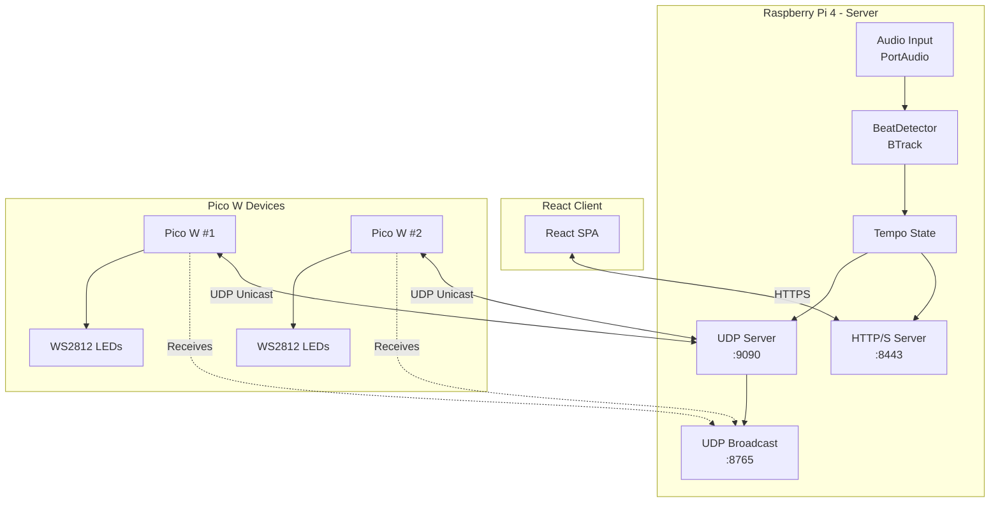
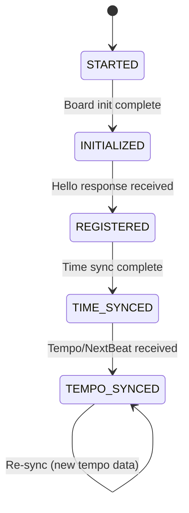
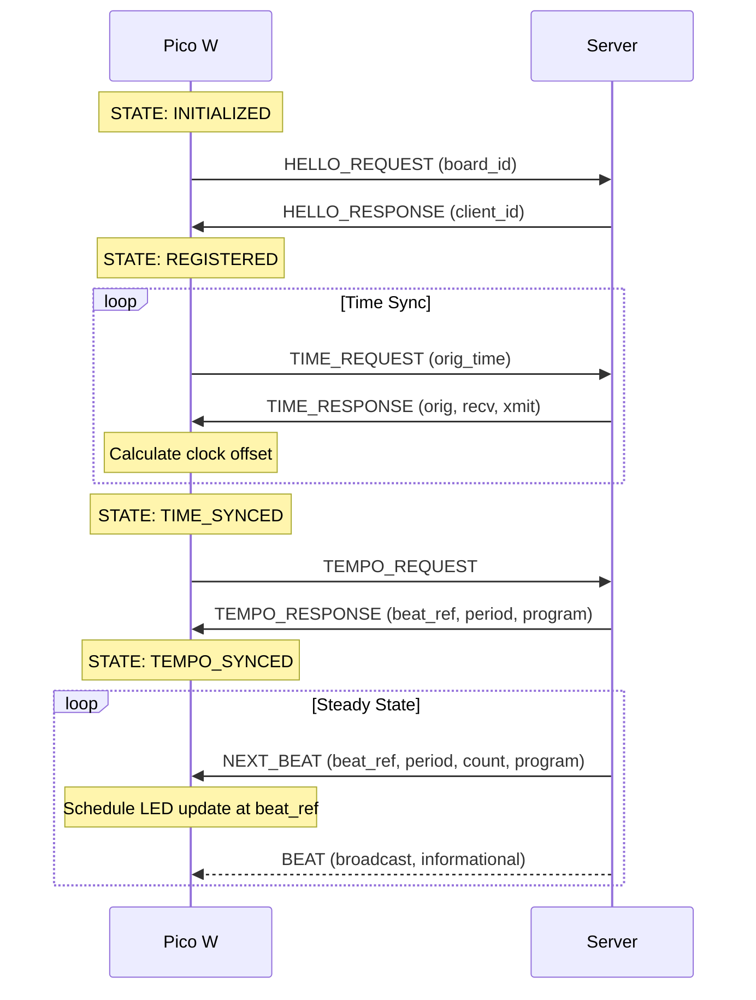
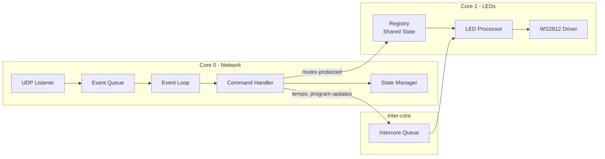

# Beatled Architecture

## System Overview

## Pico W State Machine

Each Pico W device follows this state machine for synchronization:

| State | Description |
|-------|-------------|
| STARTED | Initial state after power-on |
| INITIALIZED | WiFi connected, peripherals ready |
| REGISTERED | Server acknowledged device (assigned client_id) |
| TIME_SYNCED | NTP-style clock offset established |
| TEMPO_SYNCED | Receiving beat data, LEDs active |

## Synchronization Sequence

## Pico W Dual-Core Architecture

## Server Components

| Component | Description |
|-----------|-------------|
| `BeatDetector` | Wraps BTrack for real-time beat detection from audio input |
| `AudioBufferPool` | Pre-allocated pool of audio buffers (zero-allocation in audio path) |
| `UDPServer` | Handles device registration, time sync, and tempo distribution |
| `HTTPServer` | REST API for the web client + static file serving |
| `ServiceController` | Start/stop management for beat detector and other services |

## Client Architecture

| Layer | Technology |
|-------|-----------|
| UI Framework | React 18 + TypeScript |
| Routing | React Router v6 (data loaders) |
| Styling | Tailwind CSS 4 + shadcn/ui |
| Charts | Chart.js + react-chartjs-2 |
| Build | Vite 7 |
| PWA | vite-plugin-pwa (offline support) |
