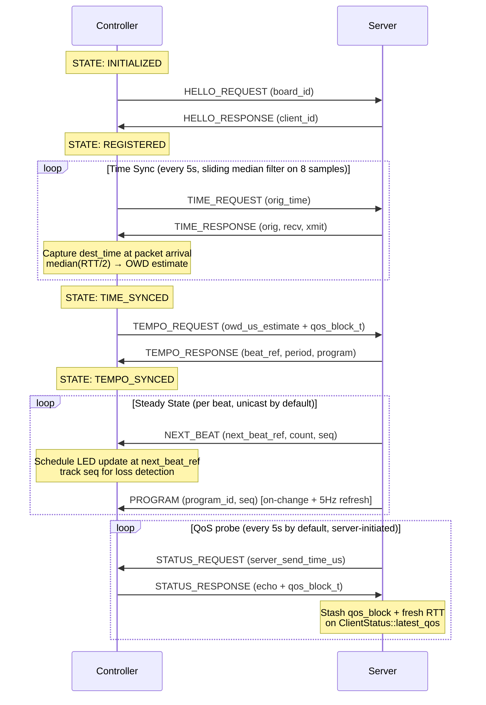

# Controller Registration and Synchronization

Controllers follow a four-phase startup sequence before LEDs become active. Each phase corresponds to a state transition in the [device state machine](../controller.html#device-state-machine).



## Phases

### 1. Registration

The controller sends a [HELLO_REQUEST](protocol.html#hello_request-1) containing its unique board ID. The server assigns a `client_id` and registers the device's IP address for future unicast messages, then replies with a [HELLO_RESPONSE](protocol.html#hello_response-2).

### 2. Time Sync

The controller performs multiple rounds of [TIME_REQUEST](protocol.html#time_request-5) / [TIME_RESPONSE](protocol.html#time_response-6) exchanges using the NTP symmetric algorithm to establish a clock offset between device and server clocks:

```
offset = ((T2 - T1) + (T3 - T4)) / 2
```

This offset is added to server timestamps so the controller can schedule LED updates at the precise moment a beat will occur.

Protocol v2 hardened this loop in three ways:

- The controller stamps `dest_time` at the *top* of the lwIP `dgram_recv` callback rather than at event-loop dequeue, so cyw43 / lwIP scheduling jitter no longer leaks into the offset.
- The refresh interval dropped from 100 s to 5 s. Each sample feeds an 8-deep ring; the controller applies the *median* offset excluding samples whose measured delay exceeds 2× the median delay, so a single Wi-Fi retransmit can no longer corrupt phase for the full interval.
- The controller tracks the most-recently-sent `orig_time` and drops `TIME_RESPONSE` whose echo doesn't match — a stale duplicate from a previous request can no longer overwrite a fresh measurement.

The median(RTT)/2 is also reported to the server as `owd_us_estimate` on the next TEMPO_REQUEST (see below).

### 3. Tempo Sync

The controller sends a [TEMPO_REQUEST](protocol.html#tempo_request-3) carrying its current `owd_us_estimate`. The server replies with a [TEMPO_RESPONSE](protocol.html#tempo_response-4) containing the current beat reference time, beat period in microseconds, and active LED program ID. The server folds the reported OWD into a per-client EWMA (α=¼) surfaced as `devices[].owd_us` — a diagnostic only. Beat timestamps are **not** delay-compensated: they travel in the synced-clock domain, where the NTP offset already absorbs path delay symmetrically, so subtracting OWD again would double-count it and skew controllers against each other by the difference of their estimates.

### 4. Steady State

The server sends [NEXT_BEAT](protocol.html#next_beat-8) messages before each beat (unicast by default; see `--broadcast-mode` in [Deployment](deployment.html)) so the controller can pre-schedule its LED update. Every client receives the same `next_beat_time_ref`: it is interpreted through each controller's negotiated clock offset, so packet delivery timing doesn't move the beat — only clock-sync error does.

[PROGRAM](protocol.html#program-7) is now pushed by the server **on state change** (instant fan-out via a StateManager callback) plus a 5 Hz refresh, so late joiners and missed broadcasts don't strand controllers on a wrong pattern. Each NEXT_BEAT and PROGRAM carries a 16-bit `seq` that the controller uses to count loss and reject stale duplicates.

Protocol v5 adds a 32-bit `epoch` to NEXT_BEAT, PROGRAM, and BEAT. The `seq` counters are per-process and reset to zero whenever the server restarts, so a controller that outlived the restart would otherwise reject every fresh push as "stale" (`delta < 0`) until the counter climbed back past its last-seen value — stranding it on the wrong pattern for up to ~an hour. The server picks a random `epoch` once at startup and stamps it on every message; the controller scopes its `seq` comparison to the current epoch and re-anchors (adopting the incoming `seq` unconditionally) the moment the epoch changes. The `seq` reset on restart is now self-healing rather than a stranding hazard.

### 5. QoS / diagnostics (protocol v4)

Two complementary diagnostic channels feed `/api/devices.qos` and `/api/qos` so operators can see fleet sync health and catch silently-degrading controllers.

**Passive metrics on TEMPO_REQUEST.** Every TEMPO_REQUEST (which controllers send every ~10 s while `TEMPO_SYNCED`) now trails a fixed 36 B `beatled_qos_block_t` carrying the controller's current view of `current_offset_us`, `uptime_us`, `median_rtt_us`, `next_beat_gap_total`, `intercore_drop_total`, `time_sync_outlier_total`, `valid_sample_count`, and `last_applied_program_seq`. The server decodes the block into `ClientStatus::latest_qos`. Zero new round-trips — the metrics piggy-back the existing heartbeat.

**Server-initiated STATUS probe.** Every `--status-probe-ms` (default 5 s) the server unicasts a `STATUS_REQUEST` carrying its current wall time to every registered client. The controller echoes the timestamp on `STATUS_RESPONSE` and trails the same `beatled_qos_block_t`; the server stamps a fresh server-controlled RTT on receipt. The probe catches a "stale but online" controller without waiting for the next 10 s TEMPO heartbeat. Set `--status-probe-ms 0` to disable.

`/api/qos` aggregates the latest snapshots: `fleet_skew_us` (the spread of per-device `sync_error_us` — see below), mean / min / max RTT, slowest device, and totals of NEXT_BEAT gaps, intercore drops, and TIME-sync outliers. The server computes a `health` verdict (`ok` / `warn` / `fail`) from operator-tuned thresholds (`--qos-skew-warn-us`, `--qos-skew-fail-us`) so the React Fleet QoS card renders a single source of truth.

**Sync error.** A device's raw `current_offset_us` is dominated by its boot epoch (its clock starts at zero at power-on), so comparing raw offsets across devices measures who booted when, not sync quality. Instead the server forms its own view of each device's offset from a consistent timestamp pair — `uptime_us` (sampled when the controller builds the QoS block) and `server_received_at_us` (stamped on arrival), separated by one OWD (≈ RTT/2):

```text
sync_error_us = current_offset_us - ((server_received_at_us - rtt/2) - uptime_us)
```

Each device's `sync_error_us` (surfaced on `devices[].qos`) estimates how far its clock sync is off; `fleet_skew_us = max(sync_error) - min(sync_error)` approximates the real worst-case beat skew across the fleet.

[BEAT](protocol.html#beat-9) is defined in the protocol catalogue for parity with the beat-detector callback but is not currently emitted by the live server. NEXT_BEAT is the steady-state timing channel.

If the tempo changes significantly, the controller re-enters tempo sync (TEMPO_SYNCED → TEMPO_SYNCED self-transition in the state machine).
