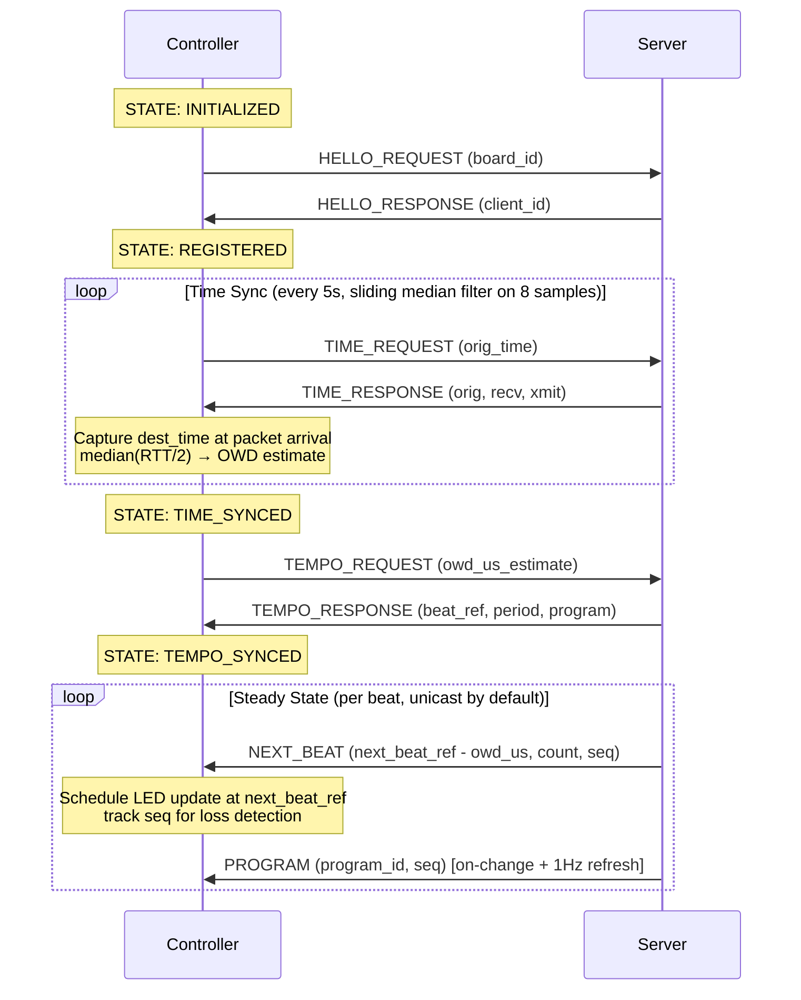

# Controller Registration and Synchronization

Controllers follow a four-phase startup sequence before LEDs become active. Each phase corresponds to a state transition in the [device state machine](../controller.html#device-state-machine).



## Phases

### 1. Registration

The controller sends a [HELLO_REQUEST](protocol.html#hello_request-1) containing its unique board ID. The server assigns a `client_id` and registers the device's IP address for future unicast messages, then replies with a [HELLO_RESPONSE](protocol.html#hello_response-2).

### 2. Time Sync

The controller performs multiple rounds of [TIME_REQUEST](protocol.html#time_request-5) / [TIME_RESPONSE](protocol.html#time_response-6) exchanges using the NTP symmetric algorithm to establish a clock offset between device and server clocks:

```
offset = ((T2 - T1) + (T3 - T4)) / 2
```

This offset is added to server timestamps so the controller can schedule LED updates at the precise moment a beat will occur.

Protocol v2 hardened this loop in three ways:

- The controller stamps `dest_time` at the *top* of the lwIP `dgram_recv` callback rather than at event-loop dequeue, so cyw43 / lwIP scheduling jitter no longer leaks into the offset.
- The refresh interval dropped from 100 s to 5 s. Each sample feeds an 8-deep ring; the controller applies the *median* offset excluding samples whose measured delay exceeds 2× the median delay, so a single Wi-Fi retransmit can no longer corrupt phase for the full interval.
- The controller tracks the most-recently-sent `orig_time` and drops `TIME_RESPONSE` whose echo doesn't match — a stale duplicate from a previous request can no longer overwrite a fresh measurement.

The median(RTT)/2 is also reported to the server as `owd_us_estimate` on the next TEMPO_REQUEST (see below).

### 3. Tempo Sync

The controller sends a [TEMPO_REQUEST](protocol.html#tempo_request-3) carrying its current `owd_us_estimate`. The server replies with a [TEMPO_RESPONSE](protocol.html#tempo_response-4) containing the current beat reference time, beat period in microseconds, and active LED program ID. The server folds the reported OWD into a per-client EWMA (α=¼) that it uses to compensate broadcast timestamps — see step 4.

### 4. Steady State

The server sends [NEXT_BEAT](protocol.html#next_beat-8) messages before each beat (unicast by default; see `--broadcast-mode` in [Deployment](deployment.html)) so the controller can pre-schedule its LED update. In unicast mode the embedded `next_beat_time_ref` is shifted by *this client's* `owd_us`, so heterogeneous Wi-Fi paths land their packets at the same intended hit instant.

[PROGRAM](protocol.html#program-7) is now pushed by the server **on state change** (instant fan-out via a StateManager callback) plus a 1 Hz refresh, so late joiners and missed broadcasts don't strand controllers on a wrong pattern. Each NEXT_BEAT and PROGRAM carries a 16-bit `seq` that the controller uses to count loss and reject stale duplicates.

[BEAT](protocol.html#beat-9) is defined in the protocol catalogue for parity with the beat-detector callback but is not currently emitted by the live server. NEXT_BEAT is the steady-state timing channel.

If the tempo changes significantly, the controller re-enters tempo sync (TEMPO_SYNCED → TEMPO_SYNCED self-transition in the state machine).
